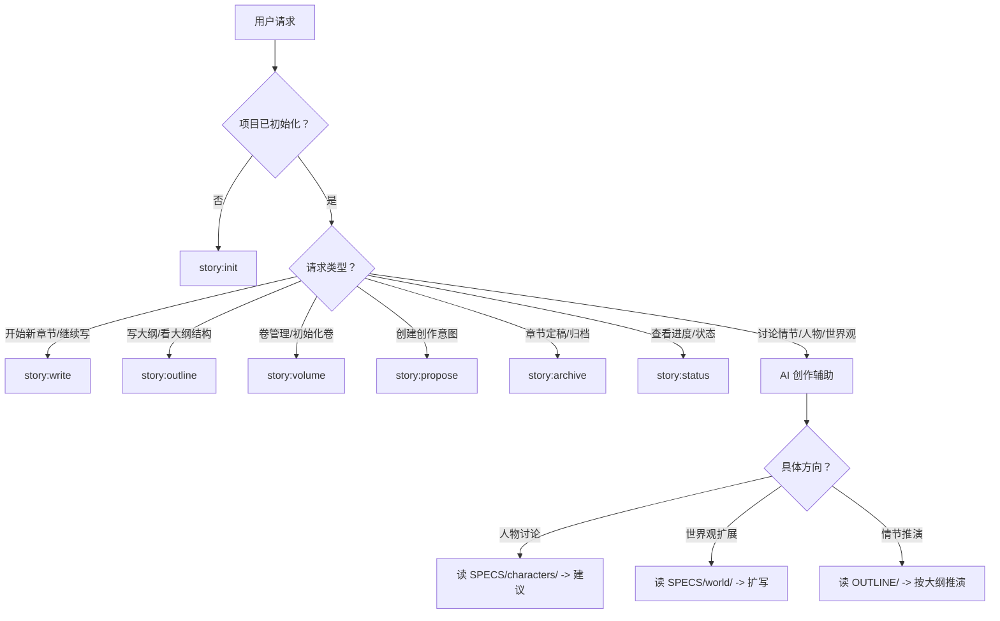

# my-novel -- AI 辅助小说写作工作流

> 把小说创作拆解为结构化的工作流：概念 -> 设定 -> 大纲 -> 写作 -> 归档。每一层都有明确的输入输出，AI 在每一层发挥不同作用。

## 核心理念

小说写作最怕"写到一半发现结构崩了"。这个工作流的核心是 **先结构后内容，先大纲后正文**。

参考 OpenSpec 的软件工程实践（proposal -> specs -> design -> tasks -> implement -> archive），将小说创作映射为类似的分层流程：

| 层级 | 对应 | 产出 |
|------|------|------|
| 概念 | proposal | story-concept.md（故事概要/核心主题） |
| 设定 | specs | SPECS/（人物、世界观、元设定） |
| 大纲 | design | OUTLINE/（总纲 -> 卷纲 -> 章节大纲） |
| 正文 | implement | CONTENT/（按卷/章节组织的正文） |
| 归档 | archive | ARCHIVE/（定稿 + 变更记录） |

### 关键设计决策

1. **卷是独立故事弧**：每卷有自己的名称、主题、高潮，不是简单地把章节分组
2. **章节大纲含场景列表**：每个章节大纲预排场景，标注 POV 和预估字数，写作时有据可依
3. **归档保留完整上下文**：每章归档时同时保存正文、任务清单、大纲、变更记录，方便回溯

### 思维模式

处理小说相关请求时，先回答三个问题：

1. **当前在哪一步？** 是构思阶段、大纲阶段、还是写作阶段？不同的阶段提供不同粒度的帮助
2. **用户需要什么？** 是项目管理（初始化/查看状态），还是创作辅助（写大纲/写正文）？
3. **设定是否一致？** 写作和大纲编辑时，时刻对照 SPECS/ 里的设定，避免前后矛盾

## 工具选择框架



**兜底规则**：用户提到"小说"但没有具体指令 -> 运行 `story:status` 展示当前项目状态。

## 前置检查

除 `init` 外，所有工作流先执行：

1. 检查当前工作目录是否有 `story.json` -> 有就用当前目录作为项目根
2. 没有 -> 向上遍历目录（最多 10 层）查找 `story.json`
3. 都没有 -> 提示用户先 `story:init` 初始化项目

找到项目根后，读取 `story.json` 获取配置信息（书名、结构、进度等），后续工作流都需要这个配置。

## 命令参考

| 命令 | 功能 | 典型参数 |
|------|------|---------|
| `story:init` | 初始化小说项目 | `[--non-interactive]` |
| `story:propose` | 创建创作意图 | `[目标] [标题]` |
| `story:volume` | 卷管理 | `[卷号] [--init] [--init-all] [--list]` |
| `story:outline` | 编辑大纲 | `[target] [--list] [--init-chapters N]` |
| `story:write` | 写作模式 | `[章节号] [--new] [--continue N]` |
| `story:archive` | 定稿归档 | `[章节号] [--preview] [--dry-run]` |
| `story:status` | 查看项目状态 | `[--json]` |

别名：`s`->status, `p`->propose, `v`->volume, `w`->write, `a`->archive, `o`->outline, `i`->init

---

## 工作流 0：init（初始化小说项目）[MIXED]

初始化创建完整的目录结构和配置文件。交互模式下由用户填写信息，非交互模式使用默认值。

### 执行步骤

#### 第一段：收集信息 [REASONING]

1. **确认项目位置**：默认当前目录，用户可指定路径
2. **交互式收集**（非交互模式跳过此步）：
   - 书名（必填）
   - 类型选择：玄幻/都市/科幻/悬疑/言情/武侠/历史/游戏/轻小说/其他
   - 目标字数（默认 500000）
   - 计划卷数（默认 3）
   - 每卷章节数（默认 30）
   - 故事概要（格式提示："一个___的___，在___中，必须___，否则___。"）
   - 主要人物（姓名 + 身份 + 描述，可添加多个，回车结束）
   - 世界观/背景（可选）
   - 每卷名称和主题（交互式逐卷填写）

#### 第二段：创建项目结构 [PROCEDURE]

```bash
python {STORY_DIR}/story.py init [路径] [--non-interactive] \
  [--title "书名"] [--genre "类型"] [--words 500000] [--volumes 3] [--logline "概要"]
```

脚本会自动创建：

```
{项目根}/
  story.json              # 配置文件（书名/结构/进度/风格）
  SPECS/
    characters/           # 人物设定
    world/                # 世界观
    meta/
      story-concept.md    # 故事概念文件
  OUTLINE/
    meta.md               # 总大纲
    volume-N.md           # 各卷大纲
  CONTENT/
    volume-N/             # 各卷正文
    draft/                # 草稿
  ARCHIVE/                # 归档
  templates/              # 模板（chapter.md / character.md / scene.md / outline.md）
  README.md
  .gitignore
```

#### 第三段：引导用户 [REASONING]

初始化完成后，告知用户目录结构和下一步操作建议：
- `story:propose` -> 创建更详细的创作意图
- `story:volume --init-all` -> 初始化所有卷的目录
- `story:outline --init-chapters 1` -> 初始化第一卷的章节大纲

### story.json 配置结构

```json
{
  "meta": { "version": "1.0", "created": "YYYY-MM-DD", "language": "zh-CN" },
  "book": { "title": "书名", "genre": "类型", "target_words": 500000, "current_words": 0 },
  "story": { "logline": "概要", "world": "世界观", "tone": "热血/成长" },
  "structure": {
    "volumes": 3,
    "chapters_per_volume": 30,
    "volume_titles": [
      { "num": 1, "title": "卷名", "theme": "主题" }
    ]
  },
  "progress": {
    "current_volume": 1,
    "current_chapter": 0,
    "written_chapters": [],
    "archived_chapters": []
  },
  "style": { "pov": "third", "tense": "past", "tone": "serious" }
}
```

---

## 工作流 1：propose（创建创作意图）[REASONING]

在正式写作前，为特定目标（概念/卷/章节）创建结构化的创作意图文档。

### 触发条件

- 用户说"创建提案"、"写个 proposal"、"这个卷/章想写什么"
- 用户想明确某一卷/章的写作方向

### 执行步骤

1. 确定目标类型：
   - `概念`/`concept` -> 故事概念提案
   - `卷N` -> 指定卷的提案
   - `第N章`/`章N` -> 指定章节的提案
   - 不指定 -> AI 引导用户选择

2. 如果是 AI 模式，根据已有信息（story.json、大纲、设定）生成结构化提案，而非创建空模板

3. 提案文件保存到：
   - 概念：`SPECS/meta/proposals/{日期}-story-concept-proposal.md`
   - 卷：`OUTLINE/volume-N/proposals/{日期}-volume-N-proposal.md`
   - 章节：`OUTLINE/proposals/{日期}-chapter-N-proposal.md`

4. 提案内容应包含：
   - 意图描述
   - 与整体故事的关系
   - 涉及的人物和世界观设定
   - 核心场景
   - 情绪目标（读者应该感受到什么）
   - 字数预期

### CLI 调用

```bash
python {STORY_DIR}/story.py propose [目标] [标题]
# 例：story.py propose 卷1 "风起天南的故事弧"
```

---

## 工作流 2：volume（卷管理）[PROCEDURE]

管理小说的卷结构：初始化、查看状态、批量操作。

### 触发条件

- 用户说"查看卷"、"初始化卷"、"卷结构"
- 用户说"开始写第二卷"

### 执行步骤

根据操作类型选择命令：

| 操作 | 命令 | 说明 |
|------|------|------|
| 查看所有卷 | `--list` 或无参数 | 表格展示所有卷的大纲/章纲/正文状态 |
| 初始化所有卷 | `--init-all` | 批量创建卷目录和大纲文件，跳过已存在的 |
| 初始化指定卷 | `N --init` | 创建 CONTENT/volume-N/ 和 OUTLINE/volume-N.md |
| 查看指定卷 | `N`（无 --init） | 展示该卷的详细状态（大纲、章纲数、正文数） |

### CLI 调用

```bash
python {STORY_DIR}/story.py volume --list          # 列出所有卷
python {STORY_DIR}/story.py volume --init-all      # 初始化所有卷
python {STORY_DIR}/story.py volume 1 --init        # 初始化卷1
python {STORY_DIR}/story.py volume 1               # 查看卷1状态
```

### 状态列含义

- `[OK]` 大纲：OUTLINE/volume-N.md 是否存在
- `N/M` 章纲：已有章节大纲数 / 每卷章节数
- `[OK]` 正文：CONTENT/volume-N/ 是否存在

---

## 工作流 3：outline（编辑大纲）[MIXED]

大纲是写作的核心骨架。分为三个层级：总纲 -> 卷纲 -> 章节大纲。

### 触发条件

- 用户说"写大纲"、"看大纲"、"编辑大纲"
- 用户说"初始化章节大纲"
- 用户说"第一章大纲是什么"

### 三个层级

| 层级 | 文件 | 内容 |
|------|------|------|
| 总纲 | `OUTLINE/meta.md` | 故事概览、卷结构、主题线索、伏笔记录 |
| 卷纲 | `OUTLINE/volume-N.md` | 本卷主题、卷概述、主要事件、章节安排、高潮、伏笔 |
| 章纲 | `OUTLINE/volume-N/chapter-NNN.md` | 本章目标、POV、场景列表、情节点、关键对话、伏笔、预估字数 |

### 执行步骤

#### 第一段：确定操作 [REASONING]

1. 根据用户意图判断编辑哪个层级
2. 如果用户没有指定，先展示大纲结构树（`--list`），让用户选择

#### 第二段：操作大纲 [MIXED]

**查看结构**：
```bash
python {STORY_DIR}/story.py outline --list
```

**批量初始化章节大纲**（AI 在此基础上填充内容，而非留空模板）：
```bash
python {STORY_DIR}/story.py outline --init-chapters 1    # 初始化卷1的所有章节大纲
```

**编辑指定大纲**：
```bash
python {STORY_DIR}/story.py outline meta                 # 编辑总纲
python {STORY_DIR}/story.py outline 卷1                  # 编辑卷1大纲
python {STORY_DIR}/story.py outline 第5章                # 编辑第5章大纲
```

#### 第三段：AI 辅助填充 [REASONING]

当用户需要 AI 帮助编写大纲内容时：

1. **总纲**：读取 story.json 的 logline、volume_titles、人物设定，生成分卷主题和核心线索
2. **卷纲**：读取总纲 + 该卷的主题，生成本卷的起承转合和章节概述
3. **章纲**：读取卷纲 + 上下章节大纲，生成场景列表（结构化格式）

**章节大纲场景格式**：
```
1. [开场] 场景描述 - POV:xxx - 约800字
2. [发展] 场景描述 - POV:xxx - 约1200字
3. [转折] 场景描述 - POV:xxx - 约1000字
```

### 注意事项

- 编辑大纲时自动读取 story.json 获取卷名和主题（从 `structure.volume_titles`）
- 章节大纲的编号基于 `chapters_per_volume` 计算所属卷号
- 批量初始化跳过已存在的文件，不会覆盖

---

## 工作流 4：write（写作模式）[MIXED]

正式写作阶段。为指定章节创建正文文件和任务清单，展示相关参考信息。

### 触发条件

- 用户说"开始写"、"写第N章"、"继续写"
- 用户说"写作模式"

### 执行步骤

#### 第一段：初始化章节 [PROCEDURE]

```bash
python {STORY_DIR}/story.py write [章节号]
# 不指定章节号则自动取 current_chapter + 1
```

脚本会：
1. 创建 `CONTENT/volume-N/chapter-NNN.md`（如果不存在）
2. 创建 `CONTENT/volume-N/chapter-NNN.tasks.md`（写作任务清单）
3. 更新 story.json 的 `progress.current_chapter` 和 `progress.written_chapters`

#### 第二段：展示写作上下文 [REASONING]

写作前，AI 应主动收集并展示以下信息：

1. **章节大纲**：读取 `OUTLINE/volume-N/chapter-NNN.md`，展示场景列表和本章目标
2. **上章回顾**（如果有）：读取上一章正文的最后 500 字，确保衔接
3. **人物设定**：读取本章涉及角色的 `SPECS/characters/xxx.md`
4. **伏笔检查**：检查前序大纲中的"伏笔记录"，确认本章是否需要回收/埋设

#### 第三段：AI 辅助写作 [REASONING]

根据用户的写作需求提供不同层次的辅助：

| 需求 | AI 行为 |
|------|---------|
| "帮我写这一章" | 按大纲的场景列表逐场景写作，严格遵循 POV 和字数预期 |
| "给我一个开头" | 基于上章结尾和本章目标，写 300-500 字的开场 |
| "这段对话不太对" | 基于人物设定调整对话风格和语气 |
| "检查连贯性" | 读取前几章正文，检查情节和人物是否一致 |

### 写作规范

- **POV 一致性**：每章保持同一 POV 角色（除非大纲明确要求切换）
- **场景过渡**：场景之间有明确的过渡段落
- **字数控制**：每个场景尽量控制在预期字数的 +-20% 范围内
- **设置检查**：涉及人物性格/外貌/背景时，对照 SPECS/characters/ 确保一致

### 任务清单格式

```markdown
# 任务清单：第N章

## 写作前检查
- [ ] 回顾本章大纲
- [ ] 确认 POV 角色
- [ ] 列出本章关键场景

## 场景任务
- [ ] 场景 1：开场/设定
- [ ] 场景 2：发展
- [ ] 场景 3：转折/高潮

## 收尾任务
- [ ] 检查情节连贯性
- [ ] 添加过渡
- [ ] 初步自检（错字、语病）

## 预期字数
约 3000 字
```

---

## 工作流 5：archive（定稿归档）[PROCEDURE]

章节写作完成后，将正文和相关文件归档，记录变更。

### 触发条件

- 用户说"归档"、"定稿"、"完成这一章"
- 用户说"archive 第N章"

### 执行步骤

#### 第一段：预览（可选）[PROCEDURE]

```bash
python {STORY_DIR}/story.py archive [章节号] --preview
```

展示归档将包含的文件列表和字数统计。

#### 第二段：执行归档 [PROCEDURE]

```bash
python {STORY_DIR}/story.py archive [章节号]
# 或模拟运行：
python {STORY_DIR}/story.py archive [章节号] --dry-run
```

归档会创建以下结构：

```
ARCHIVE/{日期}-chapter-NNN/
  final.md         # 最终版本正文
  tasks.md         # 任务清单（如果有）
  outline.md       # 章节大纲（如果有）
  delta-spec.md    # 变更规格（自动生成）
  .meta.json       # 元数据（章节号/卷号/归档时间/字数/文件列表）
```

#### 第三段：更新进度 [PROCEDURE]

归档完成后自动更新：
- `progress.archived_chapters` 添加章节号
- `book.current_words` 累加本章字数
- 生成 delta-spec.md 记录变更类型（ADDED/MODIFIED/REMOVED）

### AI 辅助

归档后，AI 可以：
1. 生成归档摘要：本章的核心事件和字数
2. 检查进度：当前总字数/目标字数，完成百分比
3. 建议下一步：下一章的大纲是否就绪？是否需要补充设定？

---

## 工作流 6：status（查看项目状态）[PROCEDURE]

展示小说项目的整体进度和状态。

### 触发条件

- 用户说"进度"、"状态"、"写到哪了"
- 用户提到小说但没有具体指令（兜底行为）

### 执行步骤

```bash
python {STORY_DIR}/story.py status [--json]
```

展示信息包括：
- **基本信息**：书名、类型、目标字数
- **写作进度**：完成百分比（进度条）、章节进度、已归档数
- **设定库**：人物数、世界观条目数
- **存储**：草稿字数、正文字数
- **最近活动**：最近修改的 5 个文件

### AI 辅助

展示状态后，AI 可以根据当前进度给出建议：
- 刚初始化 -> 建议先完善大纲
- 大纲有了但没正文 -> 建议开始写作
- 写到某卷中间 -> 提醒检查伏笔一致性
- 接近目标字数 -> 建议考虑收尾

---

## AI 创作辅助指南

当用户的请求不是明确的命令，而是创作讨论时，AI 按以下原则辅助：

### 人物讨论

1. 读取 `SPECS/characters/` 下相关人物文件
2. 基于已有设定讨论角色发展、人物关系、性格一致性
3. 如果讨论产生了新的设定，主动提出更新 SPECS 文件

### 情节推演

1. 读取 `OUTLINE/meta.md`（总纲）和对应卷的大纲
2. 在大纲框架内推演情节发展，不要脱离已有结构
3. 推演时标注"伏笔"和"呼应"，提醒用户记录

### 世界观扩展

1. 读取 `SPECS/world/` 下的设定
2. 基于已有规则扩展，确保逻辑自洽
3. 如果需要新规则，建议创建新的世界观文件

### 连贯性检查

检查维度：
- 人物性格是否前后一致
- 时间线是否有矛盾
- 伏笔是否回收
- 称呼/地名是否统一
- 力量体系/世界观规则是否一致

---

## 目录结构速查

```
{项目根}/
  story.json                        # 核心配置（JSON）
  SPECS/
    characters/{角色名}.md           # 人物设定
    world/*.md                      # 世界观
    meta/
      story-concept.md              # 故事概念
  OUTLINE/
    meta.md                         # 总大纲
    volume-N.md                     # 卷大纲（每卷一个）
    volume-N/
      chapter-NNN.md                # 章节大纲（每章一个）
  CONTENT/
    volume-N/
      chapter-NNN.md                # 正文
      chapter-NNN.tasks.md          # 任务清单
    draft/                          # 草稿
  ARCHIVE/
    {日期}-chapter-NNN/
      final.md                      # 定稿
      outline.md                    # 归档时的大纲
      tasks.md                      # 归档时的任务
      delta-spec.md                 # 变更记录
      .meta.json                    # 归档元数据
  templates/                        # 写作模板
```

## 边界与防坑

**不要跳过大纲直接写作。** 没有章节大纲就写作，很容易写到一半发现结构崩了。如果用户急着写，至少花 3 分钟列个场景列表。

**归档是单向的。** 一旦归档，正文从 CONTENT/ 移到 ARCHIVE/，不会删除但不会自动同步后续修改。如果用户想修改已归档章节，需要在 ARCHIVE/ 中直接编辑。

**卷号和章节号的计算依赖 `chapters_per_volume`。** 如果中途修改了每卷章节数，已有文件不会自动重新编号。建议在 init 阶段确定好结构，不要频繁调整。

**编码兼容性。** 所有文件使用 UTF-8 编码，输出避免 emoji（用 ASCII 符号替代），兼容 Windows GBK 终端。

## 多平台 Skill 目录

| 平台 | Skill 安装路径 |
|------|---------------|
| **WorkBuddy** | `~/.workbuddy/skills/my-novel/` |
| **Claude Code** | `~/.claude/skills/my-novel/` |
| **OpenClaw** | `~/.openclaw/skills/my-novel/` |

> `STORY_DIR` = 此 SKILL.md 所在目录。CLI 脚本位于 `{STORY_DIR}/story.py`。
> 调用时使用 `python {STORY_DIR}/story.py <command>` 执行命令。
